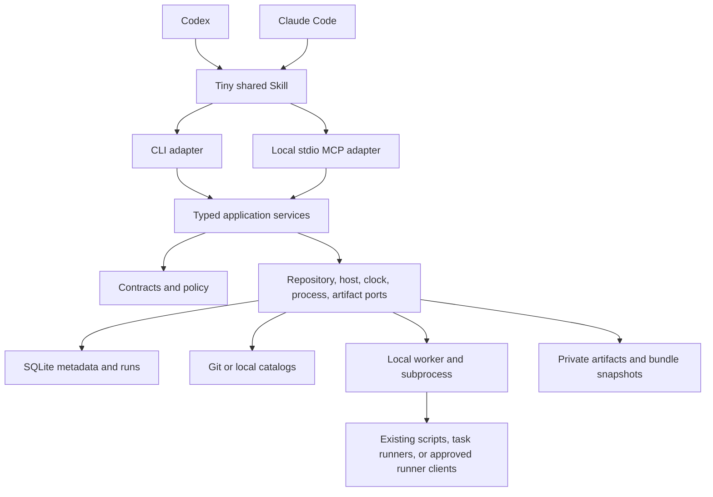

# Architecture and scope

The hypothesis is deliberately narrow: reusable executables with validated results reduce repeated agent work. Makefiles, task runners, CI, and good scripted Skills already provide much of the execution reuse. Owlmatic must earn its overhead through cross-agent discovery, consistent evidence, bounded diagnostics, and controlled version reuse. A team with ten well-maintained scripted Skills may not need it.

## Dependency direction



`bootstrap.py` chooses implementations. Application services do not import CLI/MCP or infrastructure. Protocols describe required external behavior. Strict Pydantic contracts reject extra fields and scalar coercion; state transitions use typed constructors. Frozen models are not recursively immutable containers; JSON payloads and named maps must be treated as values.

CLI and MCP contain argument mapping, dispatch, and serialization. They share trust, applicability, evidence, and run lifecycle decisions. SDK/JSON/SQLite decoding are dynamic boundaries; business entities are concrete models. Tests enforce dependency direction and prohibit `Any` and unchecked model-copy updates in the core.

Python fits this I/O-heavy system and its contributors. Rust could improve distribution and process hardening later; TS would suit a predominantly Node ecosystem. Neither changes the workflow contract. Type checking is required in CI, alongside runtime validation at external boundaries.

## State placement

```text
reviewed Git catalog/
  workflow-name/
    workflow.yaml
    input.schema.json
    output.schema.json
    run.py (or another executable)
    fixture files

OWLMATIC_HOME/                   # default ~/.owlmatic
  config.json                  # catalog sources, profiles, exact trust grants
  config.lock
  catalog.sqlite               # metadata, invocations, leases, finalization intent, resource locks, savings baselines
  reports/dashboard.html       # private, offline statistics snapshot
  bundles/<sha256>/             # verified executable snapshots
  catalogs/<source-hash>/       # bare Git fetch cache
  guards/<run_id>              # stable cross-process activity lock
  drafts/<name>/                # unpublished authoring output
  runs/<run_id>/
    job.json                   # private execution envelope; removed during finalization
    result.json
    evidence.json
    events.jsonl               # bounded, redacted stdout/stderr events
    artifacts/                 # workflow-owned files
```

The database has an explicit schema version, a transactional v1-to-v2 lifecycle migration, and a v2-to-v3 statistics migration. Run completion and pending finalization are committed together; a recovery service repairs projections and cleanup. See [recovery](recovery.md). Catalog metadata is rebuildable, but invocation/request/lock records are operational state. File configuration and SQLite are separate durability domains: a crash during catalog configuration may require registration/sync again. They are not a distributed transaction. `cleanup` removes expired terminal runs without held locks; bundle garbage collection is deferred.

Git owns source versioning and review, not credentials, logs, task authorization, or execution state. A shared server adds little to the first useful version. Stdio MCP is a local transport process. Company policy and runners can later implement the existing ports; centralized authorization must be enforced outside a user-editable profile.

## Discovery and economics

Search uses exact names first, then weighted SQLite FTS5 over names, descriptions, aliases, and example intents. It applies explicit environment, repository-name, and platform constraints before limiting database results; the repository supports paged retrieval. It returns at most three candidates within 2 KiB, with applicability checked again before execution. This is lexical search, not semantic understanding. Measure missed queries before adding embeddings; any embedding index should be derived and replaceable. Mem0 is unnecessary for executable identity or this index.

No per-workflow MCP tool or automatically loaded Skill is generated. Agents see the fixed integration and search results. `describe` expands one workflow; implementation and diagnostics are requested when needed. Include the remaining fixed Skill/tool-description cost in benchmarks, especially for short sessions or infrequently used workflows.

## Capture and review

One successful trace is insufficient evidence for safe automation. The MVP scaffolds a draft for the current agent to edit; it does not claim to compile reasoning. Extract stable commands and observations, expose changing values as typed inputs, stop on unmet prerequisites, and leave decisions requiring judgment explicit.

Positive and negative fixtures test the author's declared outcome, but do not prove truthful evidence, safe credential use, idempotency, or external determinism. Review should independently inject a broken prerequisite or stale response and verify actual system state. Prefer read-only or disposable tasks first. For mutations, document resource keys, retry semantics, partial failure, and reconciliation.

Prevent library bloat through existing Git ownership/review, exact ID uniqueness, searching before capture, and tests. The MVP rejects duplicate IDs in one catalog and retains content versions. Semantic duplicate detection, automatic promotion, popularity ranking, and enterprise approval enforcement are deferred.

## Reuse rather than rebuild

| Existing component | Responsibility | Owlmatic addition |
| --- | --- | --- |
| Skills | Instructions and packaged resources | One tiny entrypoint to an external catalog |
| MCP | Portable tool transport | Five operations over shared services |
| Make/just/task, existing scripts | Deterministic execution | Typed inputs, evidence, compact output |
| CI and workflow engines | Queuing, durability, remote execution | Workflow-specific client when needed |
| Git | Review and distribution | Digest identity, cached bundles, local grants |
| SQLite FTS5 | Search index | Applicability filtering and bounded candidates |
| Developer portals | Human discovery and ownership | Link existing catalogs; no replacement portal |
| Shell history and agent memory | Context about earlier work | Future assisted-authoring input, not execution authority |

Do not build a secrets vault, scheduler, workflow DSL, vector database, general memory engine, or enterprise portal for the MVP. Possible product value lies in reliable extraction plus independent validation and measured reuse across agents. Whether it exceeds a catalog of scripted Skills remains an experimental question.

## Roadmap and release gates

1. **Prototype / current alpha:** typed core; local/Git catalogs; lexical discovery; exact trust grants; CLI and MCP; process supervision; capture scaffold; six synthetic examples; deterministic policy tests and real adapter tests. Finish live Codex/Claude trials before claiming cross-host task-token savings.
2. **Team use:** a small reviewed catalog of repeated tasks; ownership and deprecation; tested dependency lock/release process; host-version matrix; policy audit and fault injection; independent success verifiers; repeated benchmark against the same executables invoked by scripted Skills. Add semantic retrieval only if measured misses justify it.
3. **Company-wide use:** external permission enforcement, short-lived identities, isolated runners, reviewed artifact attestations, centralized audit, scoped catalogs, and defined revocation. Integrate existing enterprise infrastructure. Add a central service only when these requirements or measured scale call for one.

Current limits include POSIX-only process/locking behavior, same-user trust, environmental dependencies outside bundle hashes, local-only idempotency/concurrency, uncertain remote effects, bounded lexical recall, and unmeasured agent economics. Live cloud integrations and automated trace extraction are not implemented.
