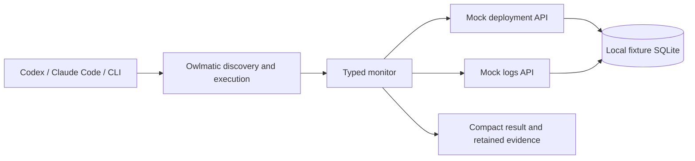

# Deploy and monitor lab

Two independent loopback HTTP processes simulate a deployment controller and log service.
The reusable workflow deploys once, waits for all three replicas, and verifies a configurable
error-free observation window. This is a production-shaped **simulation**, not a production
deployment integration. It never connects to cloud accounts or accepts real credentials.



## Run it

From a source checkout with the project's development dependencies installed:

```sh
python -m venv .venv
.venv/bin/python -m pip install -e '.[dev]'
.venv/bin/python -m scenarios.deploy_monitor.demo --minutes 1
.venv/bin/python -m scenarios.deploy_monitor.demo --minutes 1 --fault boundary_error --ingestion-delay 2
.venv/bin/python -m scenarios.deploy_monitor.demo --minutes 1 --fault missing_logs
```

Each command starts both servers on available loopback ports, prints their addresses, runs
the workflow through Owlmatic, and stops the servers. Results, input JSON, mock plans, and
server logs remain under `.owlmatic/deploy-monitor/`. The Owlmatic run ID locates its own
evidence and process logs. The default home is shared between demo runs; catalog updates
are synced and the exact bundled version is trusted only for this local lab.

`--minutes` accepts durations above zero through five minutes. The demonstration uses one
real minute; unit tests use an injected fake clock. The nine-case HTTP integration matrix
uses explicitly shorter 1.2-second windows:

```sh
.venv/bin/pytest -q tests/test_deploy_monitor.py tests/test_deploy_benchmark.py
.venv/bin/python -m scenarios.deploy_monitor.live_check
```

To keep the two mocks running independently, supply the same database and a plan JSON file:

```json
{"fault":"healthy","rollout_seconds":1.0,"error_after_seconds":60.0,"ingestion_delay_seconds":0.0}
```

```sh
.venv/bin/python -m scenarios.deploy_monitor.server deploy --port 8771 --database /tmp/owlmatic-lab.sqlite --plan /tmp/plan.json --ready /tmp/deploy.port
.venv/bin/python -m scenarios.deploy_monitor.server logs --port 8772 --database /tmp/owlmatic-lab.sqlite --plan /tmp/plan.json --ready /tmp/logs.port
```

Each command runs in its own terminal. Mock plans are controlled by the harness/server,
never by a workflow input asking it to produce a desired outcome.

## Verification contract

- Deployment acknowledgement is not success. Every expected replica must become ready on
  the exact version before the rollout deadline. Readiness time does not count toward monitoring.
- A monotonic clock enforces the observation duration. The controller's timestamp anchors
  the log interval; a source clock jump/stale status invalidates the evidence.
- Every poll verifies replica identity, version, and readiness. The complete log history also
  rejects unexpected versions. Heartbeats must cover every replica with no gap above 2.5 seconds.
- Logs use inclusive interval bounds, correlated deployment IDs, ordered unique event sequences,
  bounded advancing pagination, and a consistent completeness watermark. All pages must be read.
- After the window ends, its end stays fixed. A bounded ingestion grace lets delayed errors
  at the boundary arrive. Empty/stale/malformed/truncated/unavailable logs are inconclusive.
- Results distinguish `pass`, `fail`, and `inconclusive`. Unknown deployment acknowledgement
  preserves unknown effects. No automatic rollback or retry of deployment POSTs is attempted.

The synthetic source provides a strong completeness guarantee. Real log services often do
not provide this: an adapter cannot safely invent a watermark. Production use needs an
explicit ingestion/retention contract, a deployment audit stream to catch changes between
samples, real authorization, runtime provisioning, and deadline propagation across retries.
Heartbeats and sampled status cannot prove that nothing unobserved happened between samples.
The prototype scans the full bounded window repeatedly; large real streams need a consistent
incremental cursor and server-side aggregation, not this deliberately simple scan strategy.

## Code boundaries

`workflow/monitoring/contracts.py` defines strict immutable models; `ports.py` declares the
clock, deployment, and log boundaries. `service.py` owns verification. HTTP adapters validate
bounded responses and reject non-loopback endpoints, redirects, and inherited proxies.
`entrypoint.py` only composes dependencies and translates evidence. `fixtures.py`, `store.py`,
and `server.py` belong to the mocks and are not shipped inside the immutable workflow bundle.

The bundle currently requires Python 3.11+ and the installed Owlmatic/Pydantic environment.
The demo selects that environment explicitly. A bare `python3` in a login shell can resolve
to a different interpreter; the benchmark preserves the failed trial that exposed this.
Dependency/runtime provisioning is still a product gap, not solved by a manifest description.

## Measure tokens honestly

```sh
# Requires a working Codex login; invokes the account's model and consumes its allowance.
.venv/bin/python -m scenarios.deploy_monitor.benchmark --minutes 1

# Separate follow-up, preserving the original measurements:
.venv/bin/python -m scenarios.deploy_monitor.benchmark --cases healthy --arms owlmatic --revised-guidance --output .owlmatic/deploy-monitor/benchmark/revised
```

Arms are manual API verification, the identical monitor called directly, and Owlmatic search
plus execution. Manual agents may write helper programs. Fresh workspaces and independent
mock state avoid intentional solution reuse. All arms use Luna with low reasoning effort;
three arms may run concurrently. Raw prompts, host JSONL, final answers, server state and
usage counters are retained locally. Agent workspaces are retained separately for audit.
Do not publish raw host traces without review. This harness currently invokes Codex only;
the workflow itself works through either host's Owlmatic CLI/MCP connection.

Compare input + output tokens, cached input separately, and uncached input separately.
Reasoning tokens are a subset of output, not an additional charge in this token count.
Report correctness alongside cost. The independent fixture oracle rejects wrong outcomes
and premature results, but it is not a proof that an agent's verifier generalizes to all faults.
Source review and the deterministic fault matrix are separate evidence.

One trial per arm/case is a smoke benchmark, not a savings estimate for an organization.
The follow-up prompt is a changed treatment, not a replacement sample. Larger studies need
repetitions, randomized order, pinned host/tool context, failure recovery costs, and confidence
intervals. Setup, authoring, review and maintenance tokens are not measured by this harness.
Keep those costs explicit in break-even analysis. See [the measured report](../../docs/deploy-monitor-benchmark.md).
