# Reproduce a failed task: configurable experiments, bounded automation

This lab tests a reusable investigation procedure: extract a failed background job and its related database rows, preserve the original input/state, replay locally, and compare the error signature. It is a simulation of an invoice reconciliation job; it never connects to a company database or sends external effects.

## Add a scenario without Python changes

Copy [template.yaml](template.yaml), change the data and failure sequence, and add cases:

```yaml
version: 1
recipe: invoice-replay
cases:
  - id: another-failed-job
    amounts_cents: [499, 1299, 2500]
    revision: 42
    max_attempts: 4
    worker:
      attempts: [clean, clean, target_failure]
    expected: {finding: reproduced, attempts: 3}
```

```sh
.venv/bin/python -m scenarios.task_replay.demo --suite ./my-scenarios.yaml --validate-only
.venv/bin/python -m scenarios.task_replay.demo --suite ./my-scenarios.yaml

# Run the provided adversarial matrix:
.venv/bin/python -m scenarios.task_replay.demo
```

The suite schema is [scenario.schema.json](scenario.schema.json). Unknown fields, recipes, behaviors, duplicate IDs, and out-of-range values fail validation. YAML is data: it cannot contain arbitrary SQL, shell commands, Python callbacks, or model prompts. A mismatched expected result makes the suite command exit nonzero.

Supported knobs:

| Setting | Meaning |
| --- | --- |
| `id` | Selects a different mock job, account, historical snapshot and input rows |
| `amounts_cents`, `revision` | Vary the input collection and historical account revision |
| `max_attempts` | Bounds the experiment, from 1 to 10 |
| `worker.attempts` | Controlled sequence: `clean`, `target_failure`, `different_failure`, `input_drift`, `dirty_state`, `lost_ack`, `timeout`, `bad_postcondition` |
| `worker.environment_drift` | Simulates a mismatched worker version; execution must not start |
| `snapshot` | `complete`, `missing_state`, `missing_item`, or `unsupported_task` |
| `replay_effects` | `local_only` or `external`; external effects block replay |
| `expected` | Required finding/attempt count; optional exact reason |

The last worker behavior repeats if attempts remain. `target_failure` simulates a competing revision update before commit. The original error is an optimistic-lock conflict. An earlier unrelated error can prevent reaching that code path, so it stops the experiment as inconclusive. The fault sequence belongs to the independent mock harness; it is not an argument to the reusable workflow. No randomness or wall-clock race determines the test outcome.

## What becomes executable memory

One immutable `lab.task-reproduce` bundle receives a database path, execution ID, and experiment limits. The whole suite uses that same exact bundle reference. Cases can change without rebuilding it.

```mermaid
flowchart LR
  A[Agent selects failed execution and experiment] --> B[Read-only DB extraction]
  B --> C[Preserve historical input and state]
  C --> D[Check pinned worker and runtime]
  D --> E[Fresh local worker for each attempt]
  E --> F[Compare signature and postconditions]
  F --> G[Compact finding and retained evidence]
  G --> H[Agent diagnoses or chooses next experiment]
```



The SQL adapter reads `failed_jobs`, ordered `input_items`, and `account_snapshots` in one read-only transaction. It uses bound query parameters, checks schema version and expected row count, and rejects missing historical state instead of substituting current database state. Extraction is bounded and inputs stay in private local evidence files rather than normal agent output. It never queries arbitrary tables from a natural-language prompt.

Each attempt uses a fresh disposable process/directory and the same captured incident. The workflow checks input digest, initial state, worker code digest, Python/Pydantic versions, configuration identity, and attempt identity. Successful execution also needs the expected balance and revision changes. It stops at the first matching error, unrelated error, changed conditions, uncertain execution result, or deadline.

The compact result distinguishes:

- `reproduced`: the original signature was observed under the checked conditions.
- `not_reproduced`: the bounded attempts passed; **this never proves the issue fixed**.
- `inconclusive`: execution or comparability is uncertain; no blind retry.
- `blocked`: required evidence or allowed local replay conditions are missing.

An Owlmatic `fail` outcome for `reproduced` is a valid negative finding. Its required check is explicitly “target failure absent in bounded replay,” so `pass` means only that this bounded check passed. `diagnosis_required: true` and `proves_fixed: false` remain present for every result.

`incident.json`, its SHA-256, and `attempts.json` remain in the run's private artifacts directory. Suite inputs, individual run records and `report.json` remain under `.owlmatic/task-replay/<suite-id>/`. The original mock database is unchanged by extraction and replay.

## What remains reasoning

Choosing the relevant job, deciding whether a historical snapshot is representative, forming a causal hypothesis, changing inputs/dependencies, and selecting a fix remain explicit decisions. Observing the same signature is evidence of reproduction, not proof of the same root cause. Changing the experiment requires a new declared input/version; the workflow never silently broadens a query, switches versions, or retries a potentially duplicated external write.

This is intentionally a reusable **recipe**, not a universal debugging script. Variations of this invoice task are YAML-only. A new task family, database schema, or execution environment needs a typed adapter and verification contract once; subsequent scenarios reuse it. There is no generic YAML programming language or dynamic plugin loader. `IncidentRepository`, `Runner`, `Clock`, and `EvidenceStore` are the external boundaries; the CLI only loads configuration and invokes the suite.

## Limits and token measurement

The worker is a known local fixture from this checkout. Its subprocess receives no inherited credentials, but this is **not an operating-system sandbox for arbitrary code**. A production adapter needs real isolation, scoped read access, point-in-time data capture, redaction, and an approved dependency/runtime image. This prototype pins the fixture's source files and runtime; it does not provision a production build or certify production equivalence.

The test asks whether automation transfers to different jobs and refuses unsafe extrapolation. It does not establish provider-token savings. `provider_token_savings` remains null. Database bytes, number of queries, and internal retry loops are not tokens saved unless an actual manual/agent comparison supports that claim. This workflow was authored in this implementation session; automatic transcript-to-script capture is not being claimed.

For efficacy, use the existing measurement ledger with matched manual, direct-script and Owlmatic tasks, the same model and correctness oracle. Include the reasoning that remains after the compact result, failed reproduction attempts, initial authoring and maintenance. Never benchmark only the easy replay phase and claim savings for the whole investigation.
